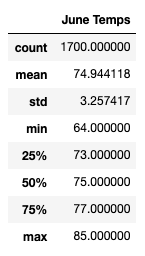
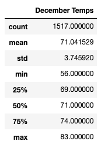
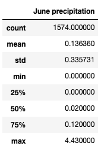
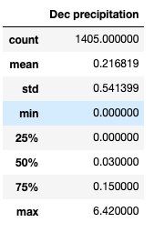

# surfs_up
Using SQLAlchemy to connect to and query a SQLite database and analyzing data retrieved 

## 1. Overview
In order to determine if the surf and ice cream shop data is sustainable year round, we are comparing weather data from June and December. Using sqlalchemy, we created a query to retrive June and December data from the Date column of the Measurement table of the sqlite file. We then put those temperatures in a list and turned it into a pandas data frame. Lastly, we generated the summary statistics.

## 2. Results
### June Temperatures

### December Temperatures

### Key Takeaways
- The average temperature is slightly higher in June (74.94) than December (71.04) which makes sense with our intuition. The difference, however, is not very large, which indicates that there shouldn't be a huge drop in business at the surf and ice cream shop in the winter. 

- The minimum temperatures are pretty different between June and December. In June, it has historically only gotten as cold as 64 degrees, while December has dropped to 56 degrees. 

- This makes sense because the standard deviation in June is (3.26) while the standard deviation in December is (3.75). This means that December temperatures fluxuate slightly more. 

## 3. Summary
### Precipitation
 

- On average, it rains more in December than June. It is possible that this could lead to less business in December, because less people probably want to surf and have ice cream in the rain. 

In conclusion, it doesn't seem like there is that big of a drop in temperature in December to significantly affect the business.
